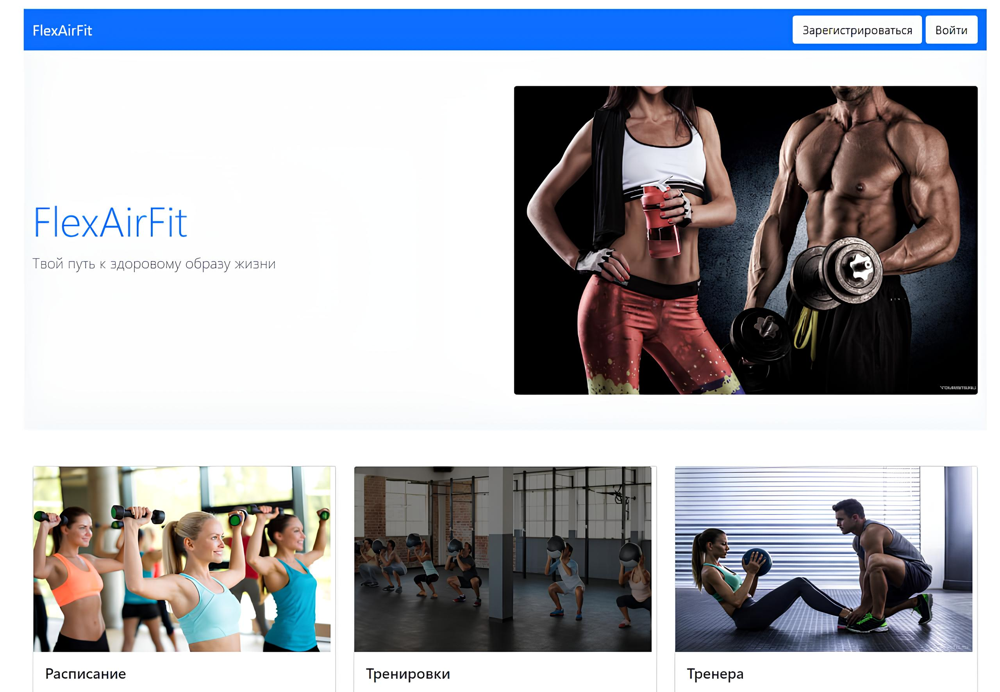
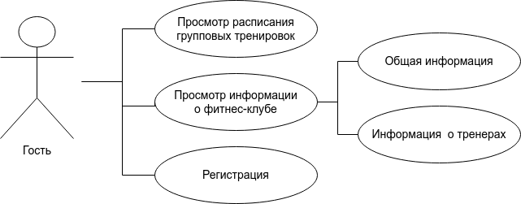
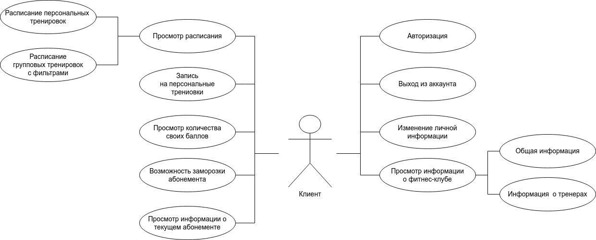
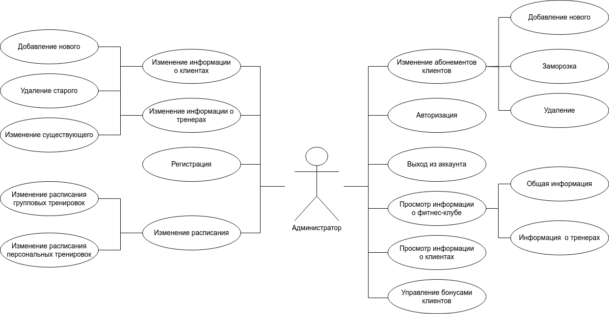
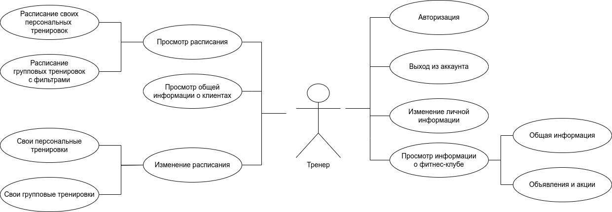
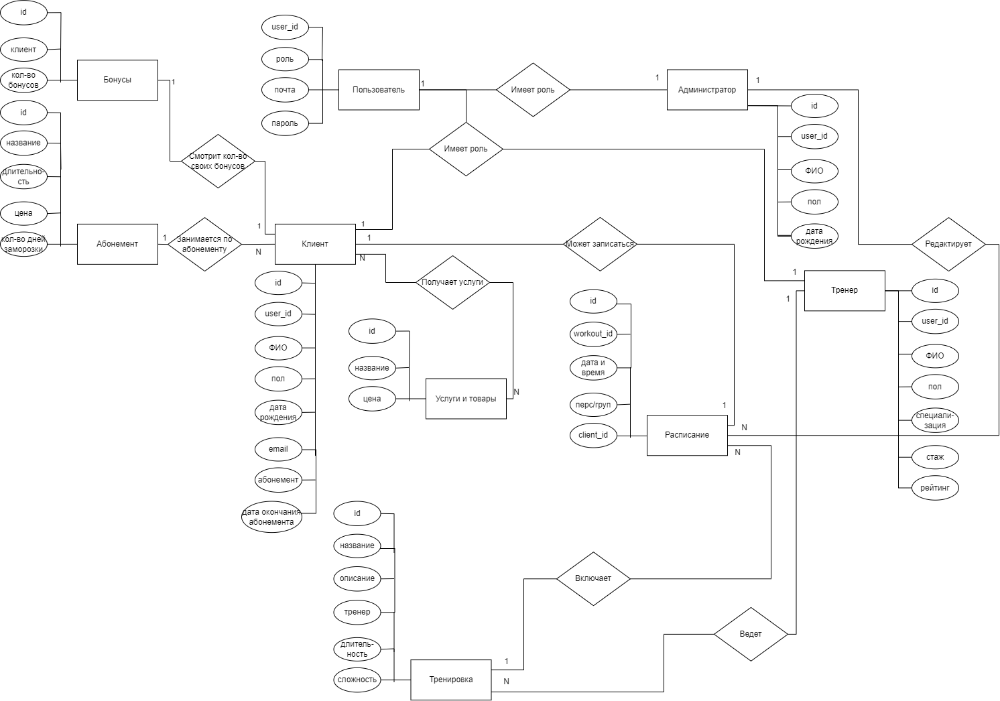
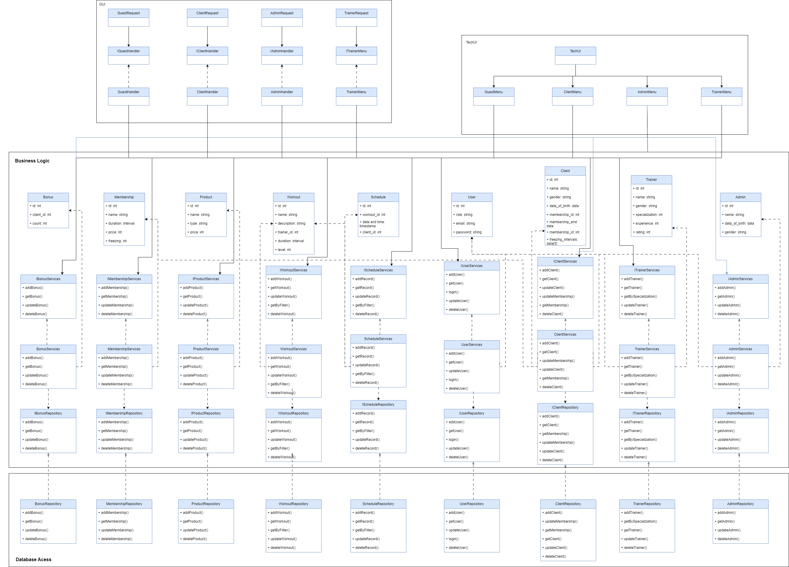

# Фитнес-клуб "FlexAirFit".

Веб-приложение, имитирующее работу фитнес-клуба. Сайт предоставляет функционал для сотрудников, клиентов и гостей клуба. Присутствует возможность просмотра и редактирования данных о клиентах и тренерах, прайс-лист, расписание тренировок, онлайн-запись на персональные тренировки и бонусная система для мотивации посещать тренировки.

# Примеры интерфейса

# Краткое описание акторов (ролей).

Неавторизованный пользователь: Это посетитель фитнес-центра, который еще не зарегистрировался на сайте или не вошел в свою учетную запись. Он не имеет доступа к личным данным, функциям бонусной программы, онлайн-записи на тренировки или другим привилегиям, доступным только зарегистрированным пользователям.

Клиент: Это зарегистрированный пользователь фитнес-центра, который имеет доступ к своей учетной записи. Он может просматривать расписание занятий, записываться на тренировки, участвовать в бонусной программе, получать информацию о тренировках, услугах и специальных предложениях.

Тренер: Это сотрудник фитнес-центра, который проводит тренировки для клиентов. Тренер может оформлять свои персональные тренировки в расписании и просматривать информацию о клиентах.

Администратор: Это сотрудник фитнес-центра, ответственный за управление сайтом и контентом. Он имеет доступ к административным функциям, таким как создание и редактирование расписания тренировок, управление информацией о тренерах, настройка бонусной программы, управление акциями и специальными предложениями, а также учетом клиентов и их данных.

# Use-Case - диаграммы. 

# ER-диаграмма сущностей.

# Технологический стек

Тип приложения: Web MPA

Backend: C#

Frontend: HTML + CSS

DB: PostgreSQL

# UML-диаграмма

